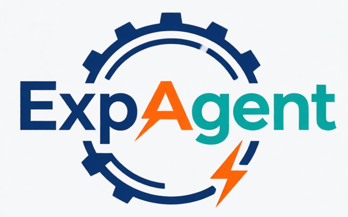
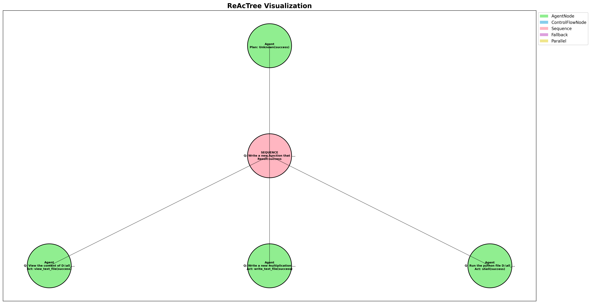

<h1 align="center">
🤖 Experiment on Agent (ExpAgent) 🤖
</h1>

<h3 align="center">
A framework to experiment on agent <strong>easily</strong>, <strong>quickly</strong>, and <strong>locally</strong>
</h3>

<p align="center">
  
</p>

- Accumulate experience with popular agents for fresh researchers
- User-friendly usage without complicated engineering implementation
- Call LLMs locally or through API key
- Actions/Tools/Skills can be unifiedly loaded and used locally
- Easily implement the planner, e.g., ReAct and ReAcTree

ExpAgent is a framework to play with agents for learning purposes, which is immature.

## 🚀 To Do List
- Skill module is not available
- More tools need to keep being developed, like `web search`, `read_project_structure`
- Dynamic acts need to be implemented
- Script of evaluation on GAIA benchmark is on the way

## 🏗️ Architecture

The project is organized into several key modules:

### Agent Model (`agent_model/`)
- Core agent implementation with support for both local models and API-based models
- Basic operations like `act`, `select`, `reasoning`, `plan`, etc. are implemented
- Built-in RAG (Retrieval Augmented Generation) functionality
- Verifier module for validating agent responses
- Support for multiple LLM providers (DeepSeek, AliCloud, etc.)

### Act Module: Actions/Tools/Skills  (`act/`)
- Unified interface for different types of agent capabilities, which is called `act`
- **Actions**: High-level operations like `answer`, which only process the text for different purposes
- **Tools**: Utility functions like calculator, file operations, shell commands, web search
- **Skills**: Specialized AI capabilities defined in markdown files with instructions

### Planners (`planner/`)
- **ReAct**: Implements the Reasoning and Acting framework with thought-action-observation cycles
- **ReAcTree**: Advanced tree-based planner supporting sequence, fallback, and parallel execution modes
- Configurable parameters for controlling agent behavior and execution limits

## 🚅 Quick Start
**Step 1**: Install the required packages
```bash
pip install requirements.txt
```

**Step 2-1**: Create ```api_keys.json```, if you would like to call LLM via API. For now, only support DeepSeek-V3.2. DashScope is used for the text-embedding model in RAG
```json
{
  "DEEPSEEK_API_KEY": "xxx",
  "DASHSCOPE_API_KEY": "xxx",
  "HF_ENDPOINT": "xxx",
  "HF_TOKEN": "xxx"
}
```

**Step 2-2**: If you would like to call local LLMs, the [MNN](https://github.com/alibaba/MNN/tree/master) (Mobile Neural Network) framework is adopted for deployment. You should download the MNN model from [modelscope](https://modelscope.cn/organization/MNN) and put it in the ```./models``` folder, like ```./models/Qwen3-4B-MNN```. If you have a GPU to accelerate the LLM, remember to configure MNN to use it.

**Step 3**: Run the run_query.py to see the result
```bash
python run_query.py
```

## 🛠️ More Usage

The `agent_interface.py` shows how to initialize a entire agent in ExpAgent:

1. Acts Initialization

```python
from act import *

# Prepare action and tool dictionaries
action_dict = {}
action_dict.update({
    "answer": Answer,
})

tool_dict = {}
tool_dict.update({
    "shell": Shell,
    "calculator": Calculator,
    "view_text_file": ViewTextFile,
    "write_text_file": WriteTextFile,
})
```

2. Agent Model Initialization

You can define `config_path` to call local MNN LLMs. If an API-based model is passed into Agent Model, the `config_path` is ignored.
In addition, you can check how to add an API-based model by `DeepSeekModel`, which is very easy.

```python
from agent_model.agent_model import AgentModel
from agent_model.api_models.deepseek import DeepSeekModel

# Initialize the local model
config_path = "./models/Qwen3-8B-MNN/"
# Initialize the API model
model = DeepSeekModel(enable_think=False)
agent = AgentModel(config_path,
                model=model,
                action_dict=action_dict,
                tool_dict=tool_dict,
                use_skills=False,
                use_rag=rag,
                planner_cfg=None,
                planner_cls=None
                )
```
`use_skills` is unavailable for now. Note that `planner_cfg` and `planner_cls` here are reserved for `perform_skill` and `perform_browser`, which need create a new agent to conduct a skill or browser.

3. Planner initialization

The `Verifier` is exploited to determine whether current query is completed. Only `config_path` or model need to be passed for `Verifier`.

The `Config` is used to set some basic parameters for the planner. For example, `Config` of `ReAcTreePlanner` contains:
- `max_steps`: the total number of the tree nodes
- `max_decisions`: the maximum decision times for a node
- `max_depth`: the depth of the tree
- `max_think`: the maximum `Think` times for a node
- `max_plan`: the maximum `Plan` times for a node

```python
from agent_model.verifier import Verifier
from planner.ReAcTree import Config, ReAcTreePlanner

verifier = Verifier(
  # cfg_path=config_path,
  model=agent.model
)
cfg = Config()
planner = ReAcTreePlanner(
  cfg=cfg,
  agent=agent,
  verifier=verifier
)
```

6. Invoke `planner.collect` to start the Agent and get the whole trajectory by `terminate_info['response']`. If you only want the final answer for the query, set `extract_answer=True`. This will call LLM to extract the final answer from the trajectory as the return. 
```python
terminate_info = planner.collect(query, extract_answer=False)
if extract_answer:
    return terminate_info
return terminate_info['response']
```

## 📋 Supported Tools

- **Calculator**: Safe evaluation of mathematical expressions
- **File Operations**: Read/write text files with range support
- **Shell Commands**: Execute system commands safely
- **Wikipedia Search**: Wikipedia search capabilities

## 🎯 Supported Planner

- **ReAct**: Traditional reasoning-acting loop for step-by-step problem solving
- **[ReAcTree](https://github.com/Choi-JaeWoo/ReAcTree/tree/main)**: The original paper of ReAcTree is designed for Long-Horizon Task Planning. ExpAgent transfers it to general daily tasks, and provides visualization of agent's decision flow. 
ReAcTree is a hierarchical tree-based planning method with three control flows:
  - Sequence: Execute subtasks in order, stop on failure
  - Fallback: Try alternatives until one succeeds
  - Parallel: Execute multiple subtasks concurrently


## Citation
```
@misc{expagent,
  title = {ExpAgent: A framework to experiment on agent easily, quickly and locally},
  author = {Caibo Feng},
  year = {2026},
}
```
